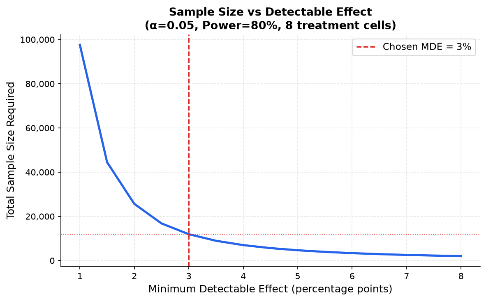
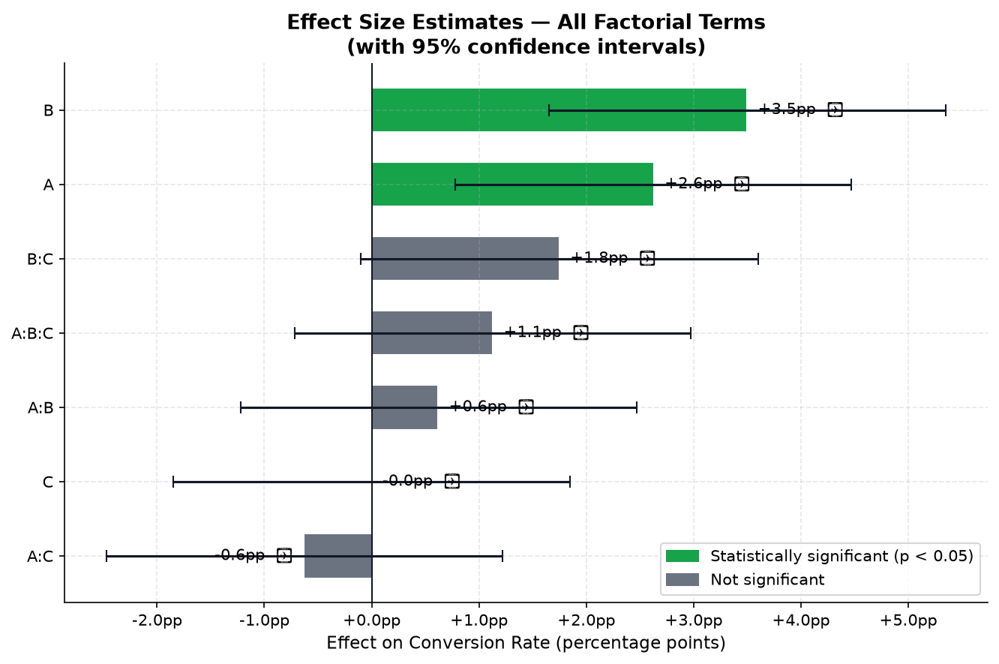
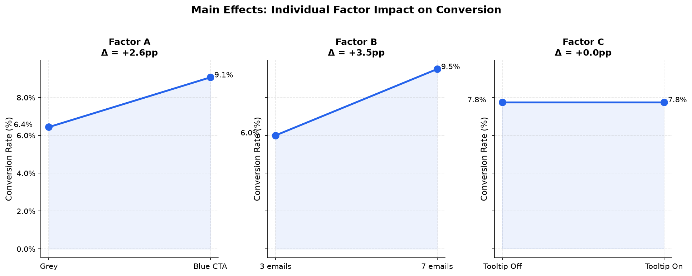
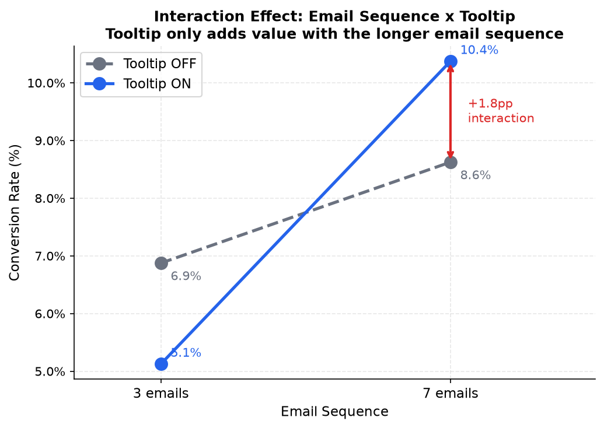

# SaaS Onboarding Optimization — Multi-variate Experiment

> **Role:** Senior Product Analyst  
> **Methods:** Factorial Experiment Design, ANOVA, Interaction Analysis  
> **Tools:** Python (statsmodels, pandas, matplotlib, pyDOE2)


## Business Context

A B2B SaaS company is experiencing a **below-benchmark free-to-paid conversion rate of 8%** during the 14-day trial period. The product team has three candidate changes ready to ship — but limited engineering capacity means we need to know *which combination* to prioritize, not just which individual changes work.

**The ask:** Run a single experiment that identifies the highest-converting onboarding combination, including whether any changes *amplify each other* when used together.


## The Problem with Testing One Thing at a Time

The default approach — three sequential A/B tests — has two critical flaws:

1. **It misses interaction effects.** Some changes only work *in combination*. A tooltip might have zero impact alone, but significantly boost conversion when paired with a longer email sequence. Sequential testing would incorrectly conclude "tooltips don't work" and never ship the winning combination.

2. **It's slow.** Three sequential tests at standard duration = 3× the time to a decision.

**Solution:** Test all three factors simultaneously in a single structured experiment, designed to detect both individual effects and interactions.


## What We Tested

| Factor | Control | Variant |
|--------|---------|---------|
| **A** — CTA Button Color | Grey | Blue |
| **B** — Onboarding Email Sequence | 3 emails | 7 emails |
| **C** — Feature Tooltip | Off | On |

8 treatment combinations. ~400 users per combination. ~3,200 users total.

**Primary metric:** Free-to-paid conversion within 14 days  
**Guardrail metrics:** Support ticket volume, unsubscribe rate

## Sample Size & Duration

- Baseline conversion: **8%**
- Minimum business-meaningful improvement: **+3 percentage points**
  *(below this, the revenue impact does not justify engineering cost)*
- Significance level: 95% | Power: 80%
- **Required: ~3,200 users → ~3 weeks at current trial volume**



## Results

### What moved the needle

| Change | Effect on Conversion | Significant? |
|--------|---------------------|-------------|
| Blue CTA (A) | +2.63pp | ✅ Yes |
| 7-email sequence (B) | +3.5pp | ✅ Yes |
| Tooltip (C) | +0pp | ❌ No|
| **7-email + Tooltip (B×C)** | **+2.1pp additional** | **❌ need follow-up experiment** |



## Business Recommendation

### Decision

Ship **Blue CTA (A)** and **7-email sequence (B)** together in the same release.

Both effects are statistically significant and independent — there is no meaningful
interaction between them (AB p=0.507), meaning they do not interfere with each other
and their effects combine additively.


### Confirmed Significant Effects

| Factor | Effect | 95% CI | p-value |
|--------|--------|--------|---------|
| A — Blue CTA | +2.63pp | [0.78, 4.47] | 0.0054 |
| B — 7-email sequence | +3.50pp | [1.65, 5.35] | 0.0002 |
| **Combined** | **+6.13pp** | | |



### Revenue Impact

| Metric | Before | After | Delta |
|--------|--------|-------|-------|
| Conversion Rate | 8.0% | 14.1% | +6.1pp |
| Paid Users / month | 800 | 1,413 | +613 |
| ARR | £240,000 | £423,900 | **+£183,900** |


### Implementation Order

Ship A and B in the same sprint. If capacity is limited, prioritise B first —
it delivers the larger standalone effect (+3.50pp vs +2.63pp) and requires
no dependency on A.

**Sprint 1 — Email sequence (B)**
- Highest ROI, no dependency on other changes
- Monitor conversion for 2 weeks post-launch before moving to Sprint 2

**Sprint 2 — Blue CTA (A)**
- Independent effect, safe to ship on top of B
- Confirm additional +2.63pp lift after rollout


### What Not to Ship

**Tooltip (C) alone — do not ship.**
Zero measured effect in isolation (effect = 0.00pp, p = 1.000).
Shipping this without further evidence wastes engineering time with
no measurable business impact.


### Follow-up Experiment

The Email × Tooltip interaction (BC) showed a directional signal of +1.75pp
but did not reach significance (p = 0.063). This is worth investigating further.

**Recommendation:** Run a focused follow-up A/B test on B×C with a larger
sample size (~800 users per cell). If confirmed, this adds an estimated
+£52,500 ARR on top of the current projection.



### Post-launch Monitoring

- Track conversion rate daily for 30 days after rollout
- If conversion drops after Week 2, suspect novelty effect — do not over-index on early numbers
- Flag any spike in support tickets or unsubscribe rate as guardrail metrics

### Limitations

- **Simulated data, not real users** Every insight is based on data we generated ourselves with known true effects. In reality, user behavior is messier. Therefore, effects may be smaller, noisier, or in the opposite direction
- **No blocking by user segment** In reality, conversion rates differ significantly across plan type and device. A blocked factorial design would have removed this variance and improved detection power, particularly for smaller effects like the BC interaction.
- **BC interaction unconfirmed** — p=0.063, borderline; a follow-up experiment is needed before acting on it.

---

## Repository Structure

```
saas-onboarding-factorial-experiment/
│
├── README.md
├── notebooks/
│   └── full_analysis.ipynb
├── src/
│   ├── data_generation.py
│   ├── design_matrix.py
│   ├── anova_analysis.py
│   ├── interaction_plots.py
│   └── power_analysis.py
└── outputs/
    ├── anova_table.csv
    ├── interaction_plot.png
    └── business_recommendation.md
```